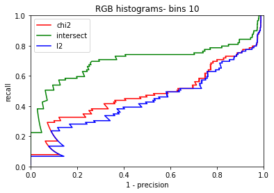

**FDS -- ASSIGNMENT 1 -- QUESTION 1-d**

We start with an initial image of a white dot over a black squared
background.

Based on convolution theory and separability, it's possible to write the
convolution2D formula:

*conv2(conv2(img_imp, Gx, \'same\'), Dx.T, \'same\')*

as

*conv2(conv2(Dx.T, Gx, \'same\'), img_imp, \'same\')*

Dx is the gaussian derivative on x which returns positive values for
each negative value of x and vice versa. Therefore, in the interval
\[-3σ, 3σ\] of our case study, we get **positive** values for Dx for all
negative values and **negative** values for all positive values.

x = \[ -, -, -, -, ..., 0, +, +, +, +...\] → Dx = \[ +, +, +, +\..., 0,
-, -, -, -...\]

x = \[ -, -, -, -, ..., 0, +, +, +, +...\] → Gx = \[+, +, +, +...,0, +,
+, +, +...\]

The shape of Dx and Gx is (1, 2σ + 1). We transpose one of those two
vectors to operate the convolution process, and obtain the (2σ+1, 2σ+1)
kernel. In other words, (2σ+1, 1) \* (1, 2σ+1) = (2σ+1, 2σ+1)

As an example, we will calculate the
convolution over Gx.T and Dx:

The positive side of the kernel represents the higher weight (higher
frequency) blurring the image (white noise in case of our white dot
example), and the negative side of the kernel shows the lower frequency
(the black side).

-   **Plot 1**: we apply a simple Gaussian Filter Gx (no derivatives
    used). We convolve the signal of the image with Gx and GxT, making
    use of the separability property. Hence, the white dot remains at
    the center of the black square, it just gets blurred by the Gaussian
    Filter. The bigger is the value of Sigma, the wider the dot gets
    blurred and it is spread around the center.

-   **Plots 2 and 3**: In this case we convolve the signal of the image
    with the vector of values of the Gaussian in each point of the given
    interval (Gx) and the transpose of the vector of values of the
    derivative of the Gaussian in each point of the given interval
    (DxT). Since the convolution has the property of commutativity, the
    result is the same for either Plot 2 and 3, regardless of whether we
    first convolve with Gx and then with DxT, or first with DxT and then
    with Gx. In both cases, the convolution with the Gaussian kernel
    only blurs the image, while the convolution with the transpose of
    the Gaussian derivative kernel blurs the image in the upper part and
    both blurs the image and inverts the grayscale values in the lower
    part.

-   **Plots 5 and 6**: This time we convolve the signal of the image
    with the transpose of the vector of the Gaussian in each point of
    the given interval (GxT), and the vector of derivatives of the
    Gaussian in each point of the given interval (Dx). The convolution
    with the transpose of the Gaussian kernel only blurs the image,
    while the convolution with the Gaussian derivative kernel blurs the
    image in the left part and both blurs the image and inverts the
    grayscale values in the right part. Plots 5 and 6 are again equal
    because of the commutative property of the convolution.

-   **Plot 4:** Plot 4 makes only use of the Gaussian derivative kernel
    and its transpose (Dx and DxT). We convolve the signal of the image
    with Dx and then with DxT. As a result, the convolution blurs the
    image in the upper left and lower right parts and both blurs the
    image and inverts the grayscale values in the upper right and lower
    left parts.

**FDS -- ASSIGNMENT 1 -- QUESTION 1-e**

By applying a Gaussian filter we get rid, from the signal of an image,
of those frequencies that are too high, and therefore not representative
of their own specific area of pixels. As a result, the noise in the
image is reduced significantly, and it gets much easier to detect the
so-called *edges*, that are those parts of the picture where fast
changes in brightness happen (for example, a line representing the
border between a red and a green object can be considered an edge).

We know that if we apply the first order derivatives of the gaussian
function to the signal of an image, we can detect the edges as the
points of local maxima. More specifically, by applying the partial
derivative in x (Dx) we sharpen the image vertically, by applying the
partial derivative in y (Dy) we sharpen the image horizontally.

What about diagonal edges? We use the gradient of the Gaussian function
as Kernel for the edge detection filter (its components are the first
order derivatives of the Gaussian in x and y):
$\ \frac{\partial f}{\partial x}$ , $\frac{\partial f}{\partial y}$.

Thanks to the gradient, we can now find the diagonal orientation of the
edges, which corresponds to the direction of the gradient vector.

As an alternative, we can determine the second order derivatives of the
Gaussian, calculated as

$$\left\| \nabla_{f} \right\| = \ \sqrt{\left( \frac{\partial f}{\partial x} \right)^{2} + \left( \frac{\partial f}{\partial y} \right)^{2}}$$

In such case, the edges correspond to the "zero crossing" points.

In the first and second image of the Assignment, the edges are detected
along a given direction, vertical or horizontal, depending on which
first order partial derivative is provided (Dx in the first image, Dy in
the second).

In the third image the edges look clearer given that both partial
derivatives are being taken into account, with the only difference that
this time we are considering second order derivatives, therefore we are
looking for zero crossings rather than local maxima.

**FDS -- ASSIGNMENT 1 -- QUESTION 3-c**

The goal of this exercise was to see how different combinations of
distance functions, histogram functions and histogram bin numbers differ
with respect to the recognition rate (the ratio between number of
correct matches and total number of query images), and to find which one
is the best. 

For a large part of the (distance function, histogram function)
combinations, reducing the number of bins from 30 to
10 raises the recognition rate up, while increasing it from 30 to
50 makes the recognition rate lower. We expected this result due to the
increase (or decrease) in the granularity found in the number of bins
variation. 

For lower number of bins, the similarity would be a more approximate and
rough measure, to the point where we might not be able to recognize them
anymore.  

For higher number of bins, there is an increase in granularity during
the selection of an image similarity candidate. For each query
image object there is a corresponding model image object, and the
difference between the objects is found in an out-of-plane rotation,
which results in different shadows and therefore different pixels
values. To put it simply, differences add up quite quickly for high
number of bins. 

The best (distance function, histogram function, number of bins)
combination is given by the intersection distance on RGB histograms with
30 bins, with results in a recognition rate of 0.8089887640449438 

On average: 

-   The best distance function is the intersection, with a mean
    recognition rate of 0.669476 across all combinations of histogram
    functions and histogram bin numbers, while the worse one is the l2,
    with a mean recognition rate of 0.432584 

-   The best histogram function is the rgb, with a mean recognition rate
    of 0.571785 across all combinations of distance functions and
    histogram bin numbers, while the worse one is the grayvalue, with a
    mean recognition rate of 0.441948 

-   The best choice regarding the number of bins is 10, with a mean
    recognition rate of 0.576779 across all combinations
    of distance functions and histogram functions, while the worse one
    is 50, with a mean recognition rate of 0.472846 

>  

Following are some results we have got from the different methods we
have available for different number of bins. 

 

  

As we can see, the only reliable metric seems to be the intersect
distance as a metric of similarity, that would be suggested by the
stability of the metric across number of bins, having comparable
performances across 10, 30 and 50. Also the TP ratio metric,
the one for evaluating performance of the model, was best for
intersection. 

**FDS -- ASSIGNMENT 1 -- QUESTION 4-b**

If we define $\delta$ as the distance between two images and $\tau$ as a
given threshold, then we can define the following two *quality
measures*:

$Precision = \frac{\text{TP}}{TP + FP}$ ,
$Recall = \frac{\text{TP}}{TP + FN}$ , where

$$TP = Number\ of\ correct\ matches\ among\ images\ with\ \delta\  \leq \ \tau$$

$$FP = Number\ of\ incorrect\ images\ with\ matches\ among\ images\ with\ \delta\  \leq \ \tau$$

$$FN = Number\ of\ correct\ matches\ among\ images\ with\ \delta\  > \ \ \tau$$

Our goal is to maximize both for best performance, ideally while keeping
the generalization of the model adequate (i.e., not overfitting).

We have a normalized distance, so by using a threshold we could indicate
whether an image was close enough or not. The pair of images with a
distance lower or equal than the threshold would be classified as a
positive match, whereas for higher than threshold distances the model
would not be indicated as a match.

As seen in the code, we first obtained the distance matrix of images.
Then, for each threshold, we checked the distance and whether we had a
true positive, false negative or false positive. To do so, we had a
reference diagonal matrix for classification, where the matching images
indices would be found on the diagonal itself; in other words, where
$Q_{i,i}$ matches $M_{i,i}$.

As we can see in the plots, and as said before in exercise 3, the
intersect distance seems to be the most reliable metric among the rest.

Also, we noticed that the \"minimum score\" given to the X\^2 distance -
see code, dist_module.py - influences the precision/recall curve, as
shown below.

Lower values for the minimum score allow the recall to start from a
better point, more than 0.5 in some cases.

Eventually, we present a study based on three different plots, showing
results for different histograms (RGB, RG, and Dx/Dy), different
distance types (chi2, l2 and intersect) and different number of bins.

In general, RGB histograms show a higher score for both recall and
precision than RG and Dx/Dy histograms. The Dx/Dy histograms always show
the worst performance with any different number of bins.

When the number of bins increases from 10 to 15, the RGB histograms also
have a better performance, as shown in Fig. 2 and Fig. 5.

As we can see, intersect distance give the best performance on the RGB
and RG histograms while it's worse on Dx/Dy histograms. In each
histogram, intersect distance has better results than l2 and chi2
distance types.

Figure 1 Recall/precision curve when using RG histogram -- bins 20

Figure 2 Recall/precision Curve when using RGB histograms -- bins 10

Figure 3 Recall/precision curve when using Dx/Dy histograms -- bins 20

Figure 4 Recall/Precision Curve when using RG histograms - bin 30

Figure 5 Recall/ Precision Curve when using RGB histograms - bins 15

Figure 6 Recall/ Precision Curve when using Dx/Dy histograms - bins 30

**Authors:**

Giovanni Giunta

Mehrzad Jafari

Francesco Lauro

Marco Muscas
